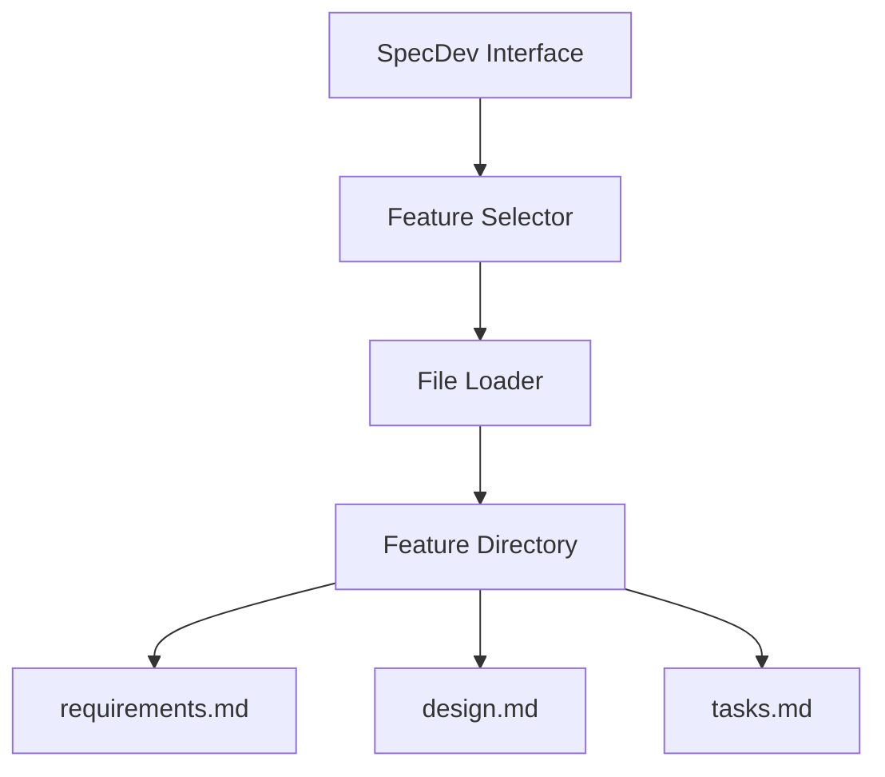
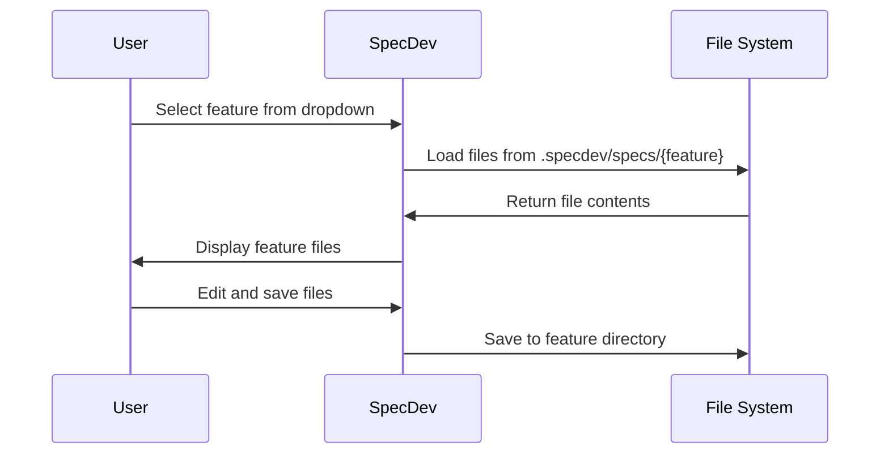

# Design Document - test-feature

## Architecture Overview

## System Components

### Feature Selector Component
Handles the dropdown selection of available features and triggers file loading.

### File Loader Component
Loads and saves files for the selected feature from the .specdev/specs/{feature} directory.

### Feature Directory Structure
Organizes specifications by feature name with consistent file structure.

## Data Flow
