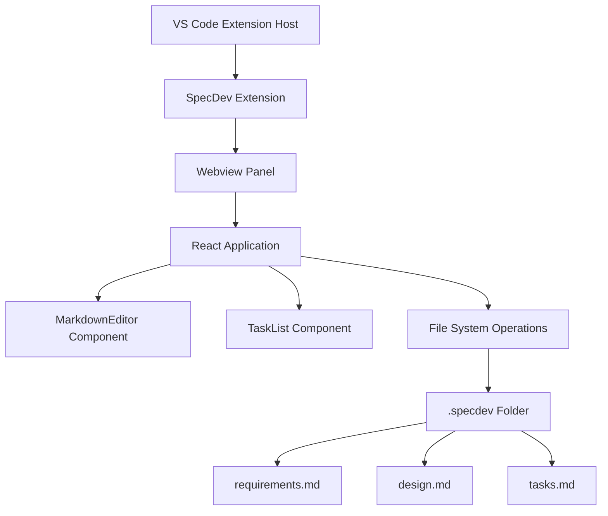
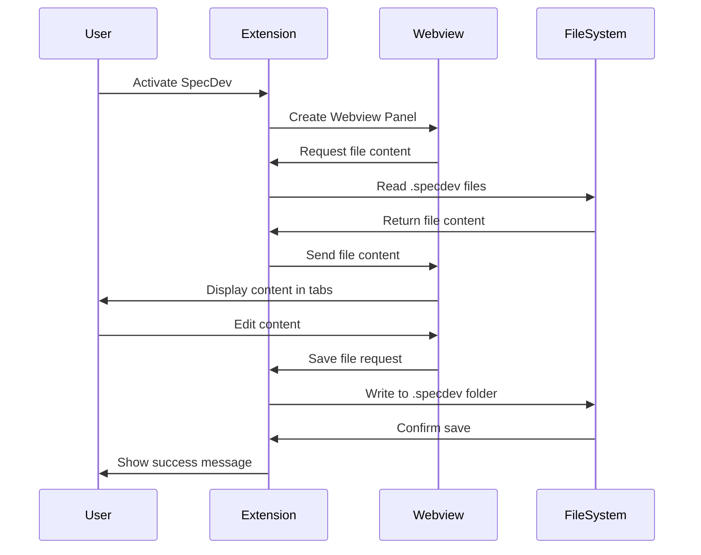
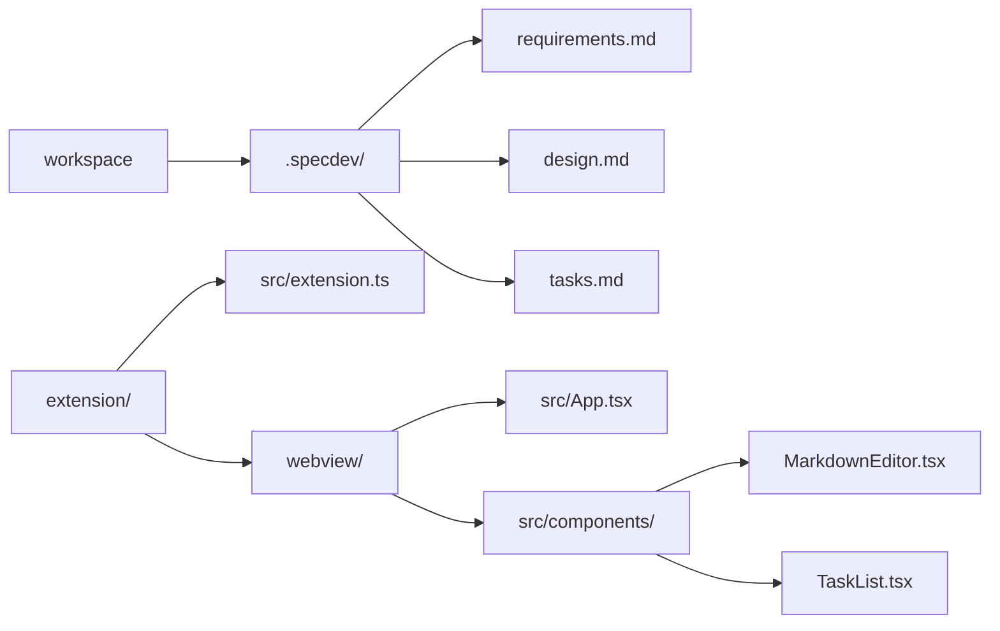

# SpecDev Extension Design

## Architecture Overview


## Component Architecture

### Extension Layer
The extension runs in the VS Code extension host and manages:
- Command registration
- Webview panel lifecycle
- File system operations
- Communication with React frontend

### React Frontend
A single-page application with three main components:
- **App**: Main container with tab navigation
- **MarkdownEditor**: Handles markdown editing and Mermaid rendering
- **TaskList**: Specialized component for interactive task management

## Data Flow


## File Structure


## Technology Stack

### Backend (Extension)
- **TypeScript**: Main development language
- **VS Code Extension API**: For integration with VS Code
- **Node.js fs module**: File system operations

### Frontend (Webview)
- **React**: UI framework
- **TypeScript**: Type safety
- **react-markdown**: Markdown rendering
- **mermaid**: Diagram generation
- **VS Code CSS Variables**: Consistent theming

## Communication Protocol

### Extension to Webview Messages
```typescript
interface ExtensionMessage {
  command: 'filesLoaded';
  content: {
    requirements: string;
    design: string;
    tasks: string;
  };
}
```

### Webview to Extension Messages
```typescript
interface WebviewMessage {
  command: 'loadFiles' | 'saveFile';
  type?: 'requirements' | 'design' | 'tasks';
  content?: string;
}
```

## Error Handling

### File Operation Errors
- Missing workspace folder
- Permission denied errors
- File system exceptions

### UI Error States
- Loading states during file operations
- Error messages for failed operations
- Fallback content for empty files

## Performance Considerations
- Debounced auto-save functionality
- Lazy loading of Mermaid diagrams
- Efficient React re-rendering with proper state management
